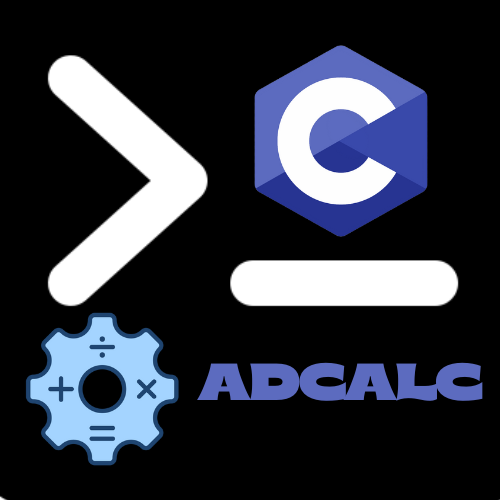

# **Most Advanced Calculator in C**

---

	

## What Can This Calculator Do?

This is not a basic calculator. It’s written completely in **C** with modular structure, using header files, and includes:

### Basic Arithmetic Operations
- Addition (`a + b`)
- Subtraction (`a - b`)
- Multiplication (`a * b`)
- Division (`a / b`)
- Modulus (`a % b`)

### Advanced Scientific Functions (using `math.h`)
- `sin(a)` – Sine of angle (in radians)
- `cos(a)` – Cosine
- `tan(a)` – Tangent
- `sqrt(a)` – Square Root
- `cbrt(a)` – Cube Root
- `round(a)` – Rounding to nearest integer
- `pow(a, b)` – Power (coming soon)

### Support
- I am a beginner **C** Developer, So please support

---
_Thanks for support!_
